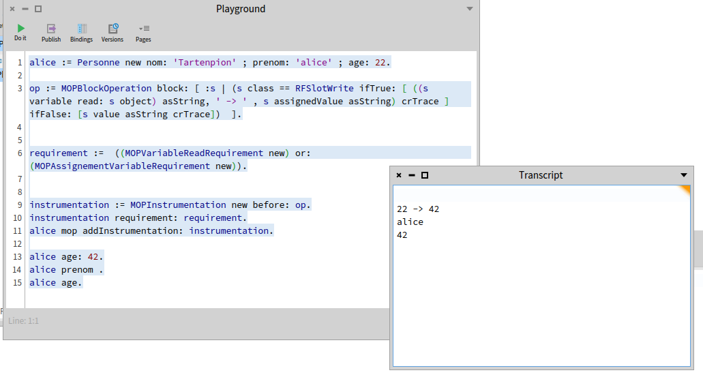

# MetaObject Protocol

## Preview

Object-oriented programming (OOP) is used in many complex software programs. As a result, finding an error using standard debugging techniques can quickly become complex.
To make OOP debugging more sensitive to object granularity, a new debugging approach has emerged. This approach is object-centric and allows to target specific objects.
The project here is to develop an object-granular debugging tool called MOP for Meta-Object-Protocol.
The goal of MOP is to be able to instrument specific objects and modify their behaviour.


## How to ?

Let's look at an example of how to use MOP :

```ST
alice := Personne new nom: 'Tartenpion' ; prenom: 'alice' ; age: 22.

op := MOPBlockOperation block: [ :s | (s class == RFSlotWrite ifTrue: [ ((s variable read: s object) asString, ' -> ' , s assignedValue asString) crTrace ] ifFalse: [s value asString crTrace])  ].


requirement :=  ((MOPVariableReadRequirement new) or: (MOPAssignementVariableRequirement new)).


instrumentation := MOPInstrumentation new before: op.
instrumentation requirement: requirement.
alice mop addInstrumentation: instrumentation.

alice age: 42.
alice prenom .
alice age.
```


In this example, we create a Person object with three instance variables:
- last name
- first name
- age

Next, we want to set up `WatchPoint` on each variable read and written. This means that for each variable that is written or read, we want to retrieve its value.

```ST
op := MOPBlockOperation block: [ :s | (s class == RFSlotWrite ifTrue: [ ((s variable read: s object) asString, ' -> ' , s assignedValue asString) crTrace ] ifFalse: [s value asString crTrace])  ].
```

To characterise this new behaviour, we set up an Operation, which here is a block. In this block, we declare that for the operation associated with reading or writing a variable, we retrieve the associated value and capture it in the `Transcript`.

In order to execute this new behaviour only on variable reads and writes, we set up `Requirements` which, for each method call, inspect each node of the method to determine whether they need to install instrumentation.

```St
requirement :=  ((MOPVariableReadRequirement new) or: (MOPAssignementVariableRequirement new)).
```

As can be seen here, `Requirements` can be composed using logical operations such as `or:` and `and:`.

The `Requirement` is associated with an `Instrumentation` which contains the operations to be performed.

Here, we decide to place our `WatchPoints` before executing the default behaviour, as can be seen here :

```ST
instrumentation := MOPInstrumentation new before: op.
instrumentation requirement: requirement.
```

We also have the option of executing this behaviour instead of the operation using the `operation:` messages, but also afterwards using the `after:` message.

Once our instrumentation has been defined, we ask the object for its MOP, which will return the protocol.

From this protocol, we can add our instrumentation.

When executing the following code :

```ST
alice age: 42.
alice prenom .
alice age.
```

The values of the variables called in these methods will be displayed in the transcript as follows:


